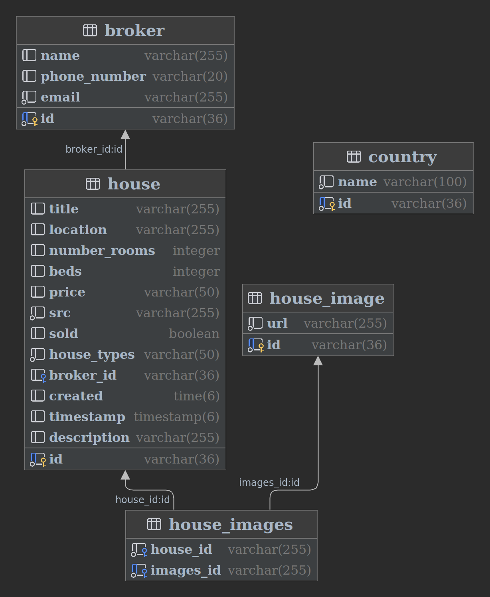

# Setup

[//]: # (![Alt text]&#40;db.png&#41;)



```
docker-compose up -d
docker exec -it postgres-monolith psql -U admin -d postgres

docker exec -it postgres-monolith psql -U admin -d postgres -c "CREATE DATABASE \"chaincue-real-estate-db\";"
```

- Create file `resources/application-secret.properties`

```
spring.security.oauth2.client.registration.keycloak.client-secret=
```

docker run --rm -it --network host -v ${PWD}:/workdir -w /workdir maven:3.9.5-amazoncorretto-21-debian bash
